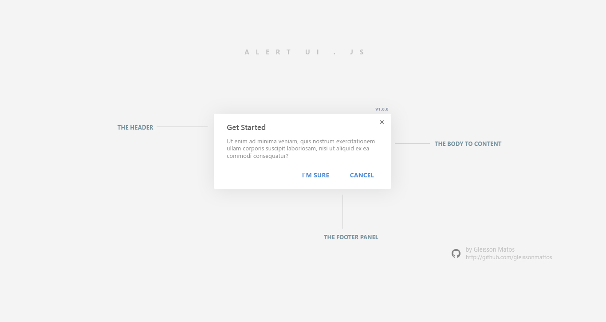
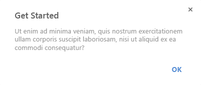
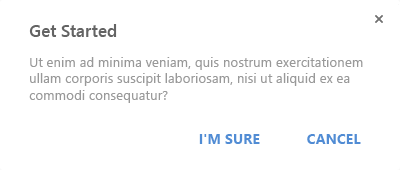
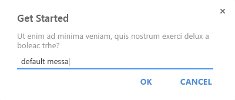

AlertUi.js
===============================

AlertUi.js is a awesome javascript framework to increase experience and interaction of users in applications.
 

## Install

* Via NPM (Recommended):  
```bash  
  npm install gleissonmattos/alertui-js
```

* Or you can just clone from GitHub. [Download (v1.0.0)](https://github.com/gleissonmattos/alertui-js.git).


## Integration

The integration is done only with insertion the files ```alertui.min.css``` and ```alertui.min.js``` in your project.

##### Example:
```html 
  <link rel="stylesheet" href="css/alertui.min.css"> 
```

```html 
  <script src="js/alertui.min.js"> 
```

Note: Verify img file ```dist/assets/img``` in your css file.

## Getting started

The Alertui.js is of easy usage. You only need execute the code in your function event. 

 

### API
- ``` alertui.alert(String, String, call(), [options]);```
- ``` alertui.confirm(String, String, callOk(), CallCancel, [options]);```
- ``` alertui.prompt(String, String, callOk(), Callback, [options]);```
- ``` alertui.notify(String, callback(), [options]);```


### Basic usage  
- alertui.alert()
```javascript
alertui.alert('Alert Title', 'Content the body area.');
```

- alertui.notify()
```javascript
alertui.notify('success', 'Your message here');
```

## Examples

Live example [click here](https://rawgit.com/gleissonmattos/alertui-js/master/example/index.html)

##### Alertui ALERT
 

###### Usage: 
```javascript
alertui.alert('Alert Ui', 
    'Excepteur sint occaecat cupidatat non proident, sunt in culpa qui officia deserunt mollit anim id est laborum.', 
    function(){
        /* Your callback function here */
    }
);
```

##### Alertui CONFIRM
 

###### Usage: 
```javascript
alertui.confirm('Confirm Ui'
    , ' Vel et elitr sadipscing consectetuer, usu cu maiestatis referrentur. Duo at tamquam nostrud, vel nonumy veritus eu.'
    , function(){
        // Notify success callback button default Ok
        alertui.notify('success', 'Every pleasure is to be welcomed and every pain avoided.');
    }, 
    function(){
        // Notify success callback button default Cancel
        alertui.notify('error', 'But in certain circumstances and owing to the claims.');
    }
);
```

##### Alertui PROMPT
 

###### Usage: 
```javascript
alertui.prompt('Prompt Ui', 
    ' Ullam corporis suscipit laboriosam, nisi ut aliquid ex ea commodi consequatur?', 
    function(_value) {
        console.log(_value); //The @param "_value" is the input value the prompt dialog
    }, 
    function(){
        alertui.notify('error', 
            'These cases are perfectly simple and easy to distinguish'
        );
    },
    'Default value'
);
```

##### Alertui NOTIFY
 

```alertui.notify(typeMessage, message)```
###### Types:
- alertui.notify([default]);
- alertui.notify([success]);
- alertui.notify([error]);

###### Usage: 
```javascript
alertui.notify('success', 
    'Your alertui.notify message here', 
);
```

## Options
The alertui component contains extra options to personalize the dialogs. Insert in last parameter the Json object with the options requered.
```javascript 
- "modal-close"  : true/false,
- "ok-value"     : "I know",
- "cancel-value" : "Back" }
```

- ```modal-close``` - is active the click to close modal or no.
- ```ok-value``` - is the value to the button primary 'OK'.
- ```cancel-value``` - is the value to the button default 'CANCEL'.

###### Example: 

```javascript
alertui.confirm('Title dialog', 
    'Your content message', 
    function(){ // Callback bt ok }, 
    function(){ // Callback bt cancel },
    {   
        "modal-close"  : false,
        "ok-value"     : "I know",
        "cancel-value" : "Back" 
    }
);
```

## Contributions
To Contribute is indispensable keep the Standard. Implement From the Files the src folder via Gulp automator and technologies Pug and SCSS files. Use npm to install the modules. ```npm install``` inside the project. 


License
=======

The MIT License ([MIT](LICENSE))
