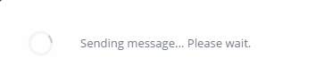
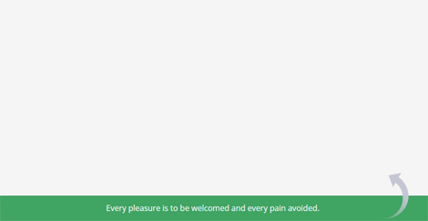

AlertUi.js
===============================
[](https://github.com/gleissonmattos/alertui-js/releases)

Awesome javascript framework to increase experience and interaction of users in applications. 
Change the browser alert dialogs for one clean, beautiful and modern dialog. 
The Alertui.js is of easy usage. You only need execute the code in your function event
Check [DEMO here](https://gleissonmattos.github.io/alertui-js/example)
 

## Install

* Via NPM (Recommended):  
```bash  
  npm install gleissonmattos/alertui-js
```

* Or you can just clone from GitHub. [Download (v1.3.3)](https://github.com/gleissonmattos/alertui-js/archive/v1.3.3.zip).


## Integration

The integration is done only with insertion the files ```alertui.min.css``` and ```alertui.min.js``` in your project.

##### Example:
```html 
  <link rel="stylesheet" href="css/alertui.min.css"> 
```

```html 
  <script src="js/alertui.min.js"> 
```

> Note: Verify img file ```dist/assets/img``` in your css file.

## Getting started

The Alertui.js is of easy usage. You only need execute the code in your function event.

 

### API
- alertui.alert(String, String, call(), [options]);
- alertui.confirm(String, String, callOk(), CallCancel, [options]);
- alertui.prompt(String, String, callOk([value]), CallCancel(), [options]);
- alertui.load(String, callLoad([loadClose()], [loadElement])); ```*NEW```
- alertui.notify(String, callback(), [options]);

> Alertui also supports key commands (```Enter``` to 'ok' and ```ESC``` to 'cancel')

### Basic usage  
- alertui.alert()
```javascript
alertui.alert('Alert Title', 'Content the body area.');
```

- alertui.notify()
```javascript
alertui.notify('success', 'Your message here');
```

## Examples

### 1. Dialogs

##### Alertui ALERT
 

###### Usage: 
```javascript
alertui.alert('Alert Ui', 
    'Excepteur sint occaecat cupidatat non proident.', 
    function(){
        /* Your callback function here */
    }
);
```

##### Alertui CONFIRM
 

###### Usage: 
```javascript
alertui.confirm('Confirm Ui'
    , ' Vel et elitr sadipscing consectetuer, usu cu maiestatis referrentur..'
    , function(){
        // Notify success callback button default Ok
        alertui.notify('success', 'Every pleasure is to be welcomed and every pain avoided.');
    }, 
    function(){
        // Notify success callback button default Cancel
        alertui.notify('error', 'But in certain circumstances and owing to the claims.');
    }
);
```

##### Alertui PROMPT
 

###### Usage: 
```javascript
alertui.prompt('Prompt Ui', 
    ' Ullam corporis suscipit laboriosam, nisi ut aliquid ex ea commodi consequatur?', 
    function(_value) {
        console.log(_value); //The @param "_value" is the input value the prompt dialog
    }, 
    function(){
        alertui.notify('error', 
            'These cases are perfectly simple and easy to distinguish'
        );
    },
    'Default value'
);
```

##### Alertui LOAD ```*NEW```
 
```javascript
/* This is the basic structure */
alertui.load('Please wait. Your message while loading...',
    function(loadClose, loadEl){
        //your implements here..  
        
        //close the alertui.load() after your implementations
        loadClose();
    }
);
```
###### Usage:


1. Example one

```javascript
alertui.load('Please wait. Your message while loading...',
    function(loadClose, loadEl){
        var area = document.body,
        elX;
        
        elX = document.createElement('h1');
        elX.innerHTML = 'Wellcome page';
        
        area.appendChild(elX);
        
        /*  This is need for close the alertui.load()
        *   Insert loadClose() at the end of the implementations */
        loadClose(); 
     
    }
);
```
2. Advanced example with Jquery

```javascript

alertui.load('Please wait. Sending message...',
    function(loadClose, loadEl){
        
        msg = 'ajax message example';
        
        $.ajax({
            url: 'https://your-url.com/request',
            type: 'post',
            data: {
                message : msg 
            },
            cache: false,
            success: function(resp){
                //Your implementations here if ok
                
                loadClose(); //Close the loading dialog     
            },
            error: function(){
                //Your implementations here if error
                
                loadClose(); //Close the loading dialog
            }
        });    
          
    }
);
```


##### Alertui NOTIFY
 

```alertui.notify(typeMessage, message)```
###### Types:
- alertui.notify([default]);
- alertui.notify([success]);
- alertui.notify([error]);

###### Usage: 
```javascript
alertui.notify('success', 
    'Your alertui.notify message here', 
);
```

## Options
The alertui component contains extra options to personalize the dialogs. Insert in last parameter the Json object with the options requered.
```javascript 
- "modal-close"  : true/false,
- "ok-value"     : "I know",
- "cancel-value" : "Back" }
```

- ```modal-close``` - is active the click to close modal or no.
- ```ok-value``` - is the value to the button primary 'OK'.
- ```cancel-value``` - is the value to the button default 'CANCEL'.

###### Example:

```javascript
alertui.confirm('Title dialog',
    'Your content message', 
    function(){ /* Callback bt ok */ }, 
    function(){ /*Callback bt cancel */ },
    {
        "modal-close"  : false,
        "ok-value"     : "I know",
        "cancel-value" : "Back" 
    }
);
```
### 2. Modal ```NEW```
Modalities are flexible, customizable and easy to use. The basic code follows the same pattern as the standard.
Just use the code in your html document

Check [example](https://rawgit.com/gleissonmattos/alertui-js/master/example/modal.html)

```html
<!-- Modal -->
<div class="alert-ui" id="modalExample">
    <div class="altui-modal">
        <div class="altui-dialog">
            <div class="altui-cmd">
                <button class="altui-close">×</button>
            </div>
            <!-- Modal header-->
            <div class="altui-header">
                Title dialog 
            </div>
            <!-- Modal body -->
            <div class="altui-body">
                This is message dialog 
            </div>
            <!-- Modal footer -->
            <div class="altui-footer">
                <button class="alt-btn alt-default altui-close">Close</button>
                <button class="alt-btn alt-primary">Button example</button>
            </div>
        </div>
    </div>
</div>
```

To display the modal use the ```.alert-to``` selector in your class attribute on the element that will call the dialog.
One data attribute (```data-modal```) must be used with the value containing the identification of said modal.

```html
<!-- Modal -->
<button class="alert-to" data-modal="modalExample">Show modal</button>
```


Enter an element within your modal with the ```.altui-close``` selector so that when clicked close the modal.

```html
<button class="altui-close">Close modal</button>
```

Modals can also be closed using the default function by passing the modal id attribute as parameter.

```javascript 
alertui.modalClose('modalExample')
```

## Contributions
To Contribute is indispensable keep the Standard. Implement From the Files the src folder via Gulp automator and technologies Pug and SCSS files. Use npm to install the modules. ```npm install``` inside the project. 

## News [version 1.3.1]
- New AlertUi MODAL
- Auto scrollbar

License
=======

The MIT License ([MIT](LICENSE))
